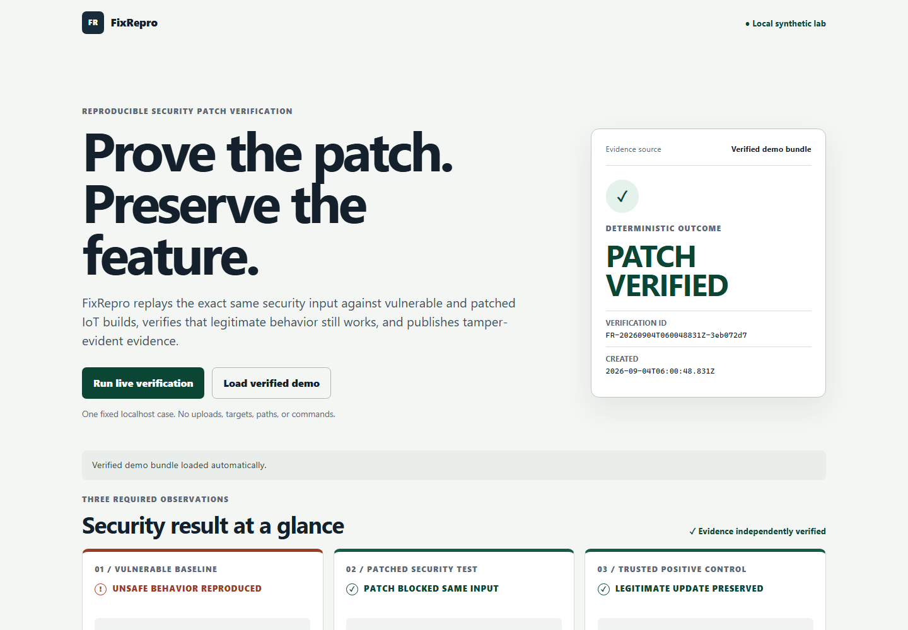
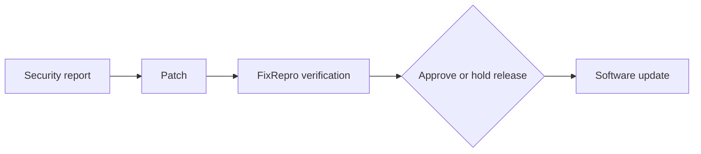
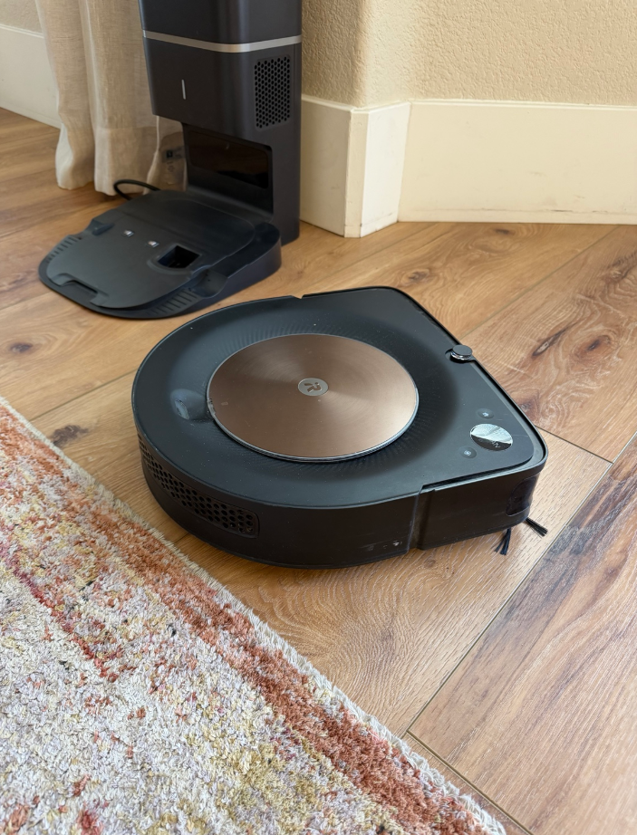

# FixRepro

FixRepro replays the same security test against vulnerable and patched robotics or IoT builds, captures hash-verified evidence, and proves the fix without breaking legitimate behavior.

[](https://github.com/ibondarenko1/fixrepro/actions/workflows/ci.yml)



*The dashboard shows the unsafe baseline, rejection of the exact same input, and a successful trusted positive control.*

## Why FixRepro

FixRepro is the missing verification step between “the patch was merged” and “the update is safe to ship.”

A code change alone does not prove that a security fix works. FixRepro turns a narrow security regression into a repeatable release decision backed by evidence.

## How it works

FixRepro tests a three-part security contract, then publishes the result:

1. Reproduce the unsafe behavior.

2. Replay the exact same input against the patched build.

3. Confirm that legitimate behavior still works.

4. Publish evidence another person or release system can verify.

Only the complete chain can produce `PATCH_VERIFIED`. The verdict comes from recorded observations and deterministic rules, not from a language model or a browser-side calculation.



## Physical-world proof of concept



*Roomba s9+ used as an audible physical-output witness during an owner-authorized proof of concept.*

An owner-controlled Roomba s9+ produced a supported Locate melody during a separate authorized local test.

It demonstrates how an accepted FixRepro result can be connected to a physical output. The Roomba did not receive firmware and was not the OTA target.

The reproducible Docker workflow uses the synthetic virtual device. Roomba support is optional and disabled by default.

The proof of concept is supplemental: no Roomba vulnerability was tested or claimed, no Roomba firmware was installed or modified, and the physical witness cannot change the core verdict.

See [Physical witness](docs/PHYSICAL_WITNESS.md) and the [sanitized proof record](docs/evidence/roomba-locate-proof.json).

## Who can use it

- Robotics and IoT manufacturers validating a fix before a remote update ships.

- Product Security teams using a controlled result to approve or hold a release.

- Open-source maintainers checking a contributed security patch.

- Auditors and enterprise customers reviewing what was tested instead of relying on a claim.

## Why now

More physical products depend on software and remote updates. Teams need repeatable proof before one security update reaches many connected devices.

## Quick start

```bash
git clone https://github.com/ibondarenko1/fixrepro.git
cd fixrepro
docker compose up --build
```

Open `http://127.0.0.1:8000`. For a repository-local Python setup, see [Dashboard operation](docs/DASHBOARD.md).

## Evidence

The tracked demonstration bundle can be reviewed without running the lab:

- [Verification report](evidence/demo-bundle/report.html)

- [Evidence JSON](evidence/demo-bundle/evidence.json)

- [Manifest JSON](evidence/demo-bundle/manifest.json)

- [Manifest digest](evidence/demo-bundle/manifest.sha256)

Run an independent check with:

```bash
python scripts/verify_bundle.py evidence/demo-bundle
```

The Evidence bundle records the complete package hash, request and response hashes, device state transitions, and one execution for each role. Bundle verification recalculates file hashes and the Verification orchestrator verdict. The bundle is tamper-evident when its published digest is retained separately; it does not replace an externally trusted signature.

## Architecture

The Web dashboard and Control API start one fixed Verification orchestrator job. That job exercises a Virtual device, Vulnerable gateway, and Patched gateway on loopback, then generates an HTML report and a tamper-evident bundle. Verified demo-bundle loading and Safe artifact serving use an internal bundle registry and reverify files before presentation.

See [Architecture](docs/ARCHITECTURE.md) for the component and trust-boundary details.

## Security boundaries

- All services are local and synthetic; Docker Compose publishes only the dashboard on `127.0.0.1:8000`.
- The browser cannot supply targets, packages, keys, commands, or output paths.
- Private Ed25519 keys exist only in memory during Ed25519 package generation.
- Background live verification accepts one fixed workflow at a time.
- There are no uploads, external test targets, CORS support, cookies, analytics, or cloud dependencies.
- Simulator endpoints are intentionally unauthenticated and are not production interfaces.

## Limitations

FixRepro proves only that the defined signer-trust regression behaved as recorded under the tested conditions. It does not prove that every vulnerability is fixed or that a build is generally secure. The lab does not provide production fleet management, persistent device state, production key management, or a public deployment. The physical-output witness is not part of the reproducible OTA target or Docker workflow.

## Technology stack

Python 3.12, FastAPI, Pydantic, Ed25519 through `cryptography`, HTTPX, JSON Schema Draft 2020-12, pytest, plain HTML, CSS, JavaScript, Docker, Docker Compose, GitHub Actions, and an optional Paho MQTT witness transport. Unit tests, integration tests, the three-scenario demonstration runner, and repository validators protect the established contracts.

## License

FixRepro is available under the [MIT License](LICENSE).
