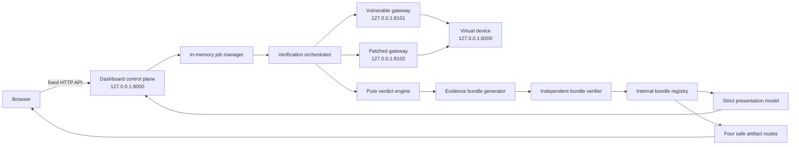
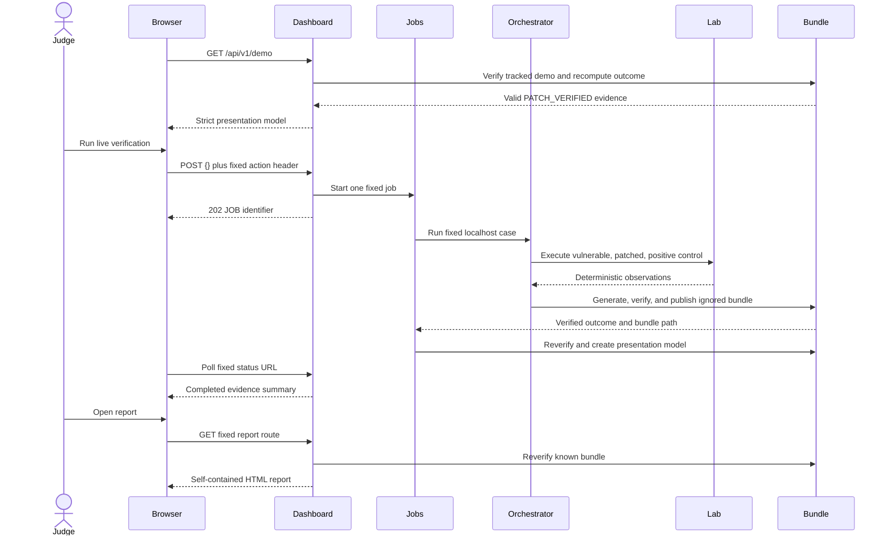

# Architecture

Phase 4 adds the judge-facing control plane and presentation layer without changing the deterministic Phase 3 verifier, evidence schema, signing contract, or bundle format.

## Components

| Component | Responsibility | Interface | Status |
|---|---|---|---|
| Browser dashboard | Present verified evidence and request the one fixed run | Local HTML, CSS, and JavaScript | Implemented |
| Dashboard control plane | Validate requests, expose safe summaries, and serve approved artifacts | `127.0.0.1:8000` | Implemented |
| In-memory job manager | Serialize verification work and retain ten finished jobs | Internal | Implemented |
| Verification orchestrator | Start services, reset state, replay packages, and collect observations | Local Python API | Implemented |
| Vulnerable OTA gateway | Model integrity-only update acceptance | `127.0.0.1:8101` | Implemented |
| Patched OTA gateway | Enforce payload integrity, signer trust, and Ed25519 verification | `127.0.0.1:8102` | Implemented |
| Virtual device | Hold resettable synthetic firmware state | `127.0.0.1:8200` | Implemented |
| Verdict engine | Derive individual and overall outcomes using pure functions | Internal | Implemented |
| Evidence and report generators | Write strict evidence and a self-contained HTML report | Internal | Implemented |
| Bundle verifier | Verify every file and recompute verdicts | Local Python API and CLI | Implemented |
| Presentation mapper | Convert a verified evidence model into judge-facing data | Internal | Implemented |

## Dashboard data flow

1. The browser loads the local dashboard and requests the fixed demo summary.
2. The control plane resolves `demo` through its internal bundle registry.
3. The independent bundle verifier checks paths, hashes, schema, raw records, signatures, and recomputed verdicts.
4. The presentation mapper parses `evidence.json`, maps executions by role, and compares both exact-input hashes.
5. The browser renders only the resulting strict presentation model.
6. A live-run request contains only `{}` and a fixed action header.
7. The job manager starts one `VerificationOrchestrator` in a non-daemon worker and rejects concurrent work.
8. The orchestrator creates a normal ignored bundle under `evidence/runs`, verifies it, and registers the job ID to that resolved directory.
9. The presentation path verifies the live bundle again before returning it.
10. Every artifact request independently verifies the known bundle before serving one fixed top-level file.

## Runtime observation boundary

Gateway and device responses are runtime observations. They become strict evidence records, but stored verdict labels remain untrusted. The bundle verifier recomputes individual and overall outcomes using the pure verdict engine before any presentation or artifact response is allowed.

The browser never receives package payloads, public-key bodies, raw response records, logs, local paths, environment variables, or service commands.

## Trust boundaries

1. **Browser to control plane:** accepts only fixed routes and an empty live-run request.
2. **Job manager to orchestrator:** starts one fixed case without browser-provided configuration.
3. **Orchestrator to gateways:** replays the same untrusted byte array against both builds.
4. **Gateways to device:** a gateway decision controls synthetic device state.
5. **Runtime to evidence:** contradictory or incomplete observations cannot become `PATCH_VERIFIED`.
6. **Stored evidence to presentation:** the bundle is independently verified and verdicts are recomputed.
7. **Bundle registry to artifact routes:** opaque IDs map to known resolved directories; IDs never become paths.
8. **Manifest digest to external retention:** modification detection depends on keeping the root digest separately.

## One-container topology

Docker keeps the dashboard, orchestrator, and its three child services in one non-root container. The dashboard binds to `0.0.0.0` only inside container mode. Compose publishes only `127.0.0.1:8000:8000`; ports 8101, 8102, and 8200 remain private loopback listeners in the container.

## Architecture diagram

## Judge interaction sequence

