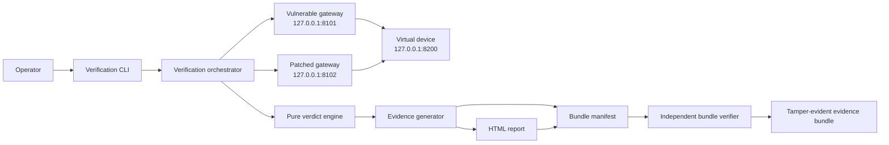
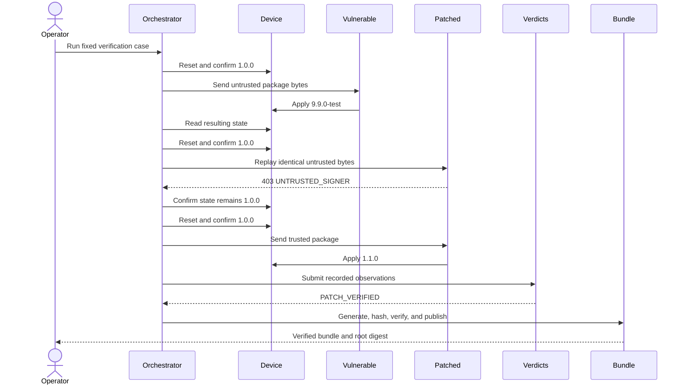

# Architecture

Phase 3 implements the localhost OTA lab, deterministic verification orchestrator, evidence and report generation, manifest creation, and independent bundle verification. The final dashboard remains planned.

## Components

| Component | Responsibility | Interface | Status |
|---|---|---|---|
| Virtual device | Hold resettable synthetic firmware state | `127.0.0.1:8200` | Implemented |
| Vulnerable OTA gateway | Model integrity-only update acceptance | `127.0.0.1:8101` | Implemented |
| Patched OTA gateway | Enforce payload integrity, signer trust, and Ed25519 verification | `127.0.0.1:8102` | Implemented |
| Verification orchestrator | Start services, reset state, replay packages, and collect observations | Local Python API and CLI | Implemented |
| Verdict engine | Derive individual and overall outcomes using pure functions | Internal | Implemented |
| Evidence generator | Write raw records and schema-valid `evidence.json` atomically | Internal | Implemented |
| Report generator | Render a self-contained HTML explanation from finalized evidence | Internal | Implemented |
| Bundle generator | Hash final artifacts and publish a root manifest digest | Internal | Implemented |
| Bundle verifier | Check paths, files, schema, package identity, and recomputed verdicts | Local CLI | Implemented |
| Final web dashboard | Present and initiate verification runs | Planned port 8000 | Planned |

## Implemented data flow

1. Fresh trusted and untrusted signing identities are created in memory. Only public keys and signed synthetic packages are written under ignored runtime storage.
2. The orchestrator reads the untrusted package once and retains that immutable byte array for both the vulnerable and patched requests.
3. The three services start on fixed loopback ports and expose stable build identifiers.
4. Before each scenario, the orchestrator resets the device and confirms the complete initial state.
5. Each request, response hash, gateway decision, reason code, and independently read device state is recorded.
6. Pure verdict functions derive individual verdicts and the overall outcome.
7. Package copies, raw scenario records, the trusted public key, and the high-level run log are finalized first.
8. `evidence.json` lists those artifacts, followed by `report.html`, `manifest.json`, and `manifest.sha256`.
9. The independent verifier checks the staged bundle before publication and checks the published bundle again.

## Trust boundaries

1. **Operator to orchestrator:** CLI arguments select output behavior but cannot provide verdicts.
2. **Orchestrator to gateways:** the same untrusted byte array crosses this boundary twice.
3. **Gateways to device:** a gateway decision controls whether synthetic state may change.
4. **Runtime observations to stored evidence:** response and device observations are converted into strict records; a contradiction produces `INCONCLUSIVE`.
5. **Stored evidence to bundle verifier:** stored verdict labels are untrusted and recomputed from observations.
6. **Manifest digest to external retention:** modification can be detected only when the root digest is retained separately from the bundle.

All HTTP listeners bind to `127.0.0.1`. No implemented component sends requests to an external target.

## Reset and deterministic outcome

Every scenario requires firmware `1.0.0`, update counter `0`, and no prior payload hash after reset. `PATCH_VERIFIED` requires the vulnerable unsafe transition, the patched rejection of identical request bytes, and the successful trusted positive control. Complete patch regressions produce `PATCH_NOT_VERIFIED`; missing, conflicting, or operationally affected observations produce `INCONCLUSIVE`.

## Evidence generation

JSON files use sorted keys, two-space indentation, UTF-8, and a final newline. Atomic writes use a temporary file in the destination directory, flush it, and replace the final path. The manifest excludes itself and its digest file to avoid circular hashing. `report.html` also does not embed the final root digest because the report is covered by the manifest.

## Architecture diagram

## Verification sequence

