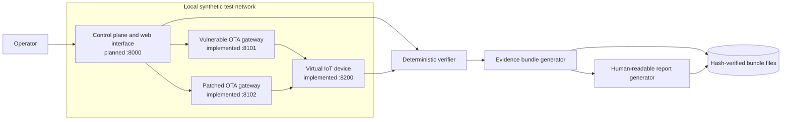
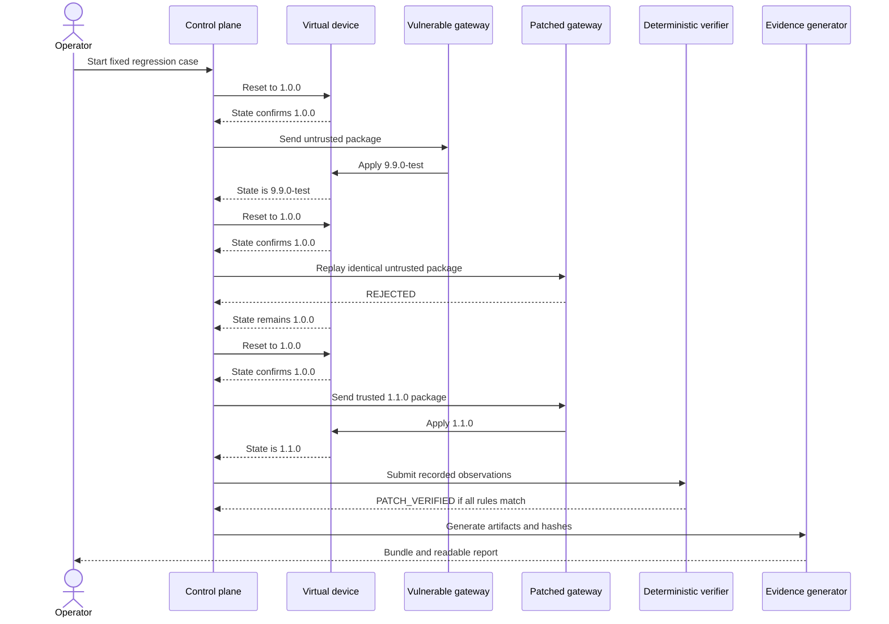

# Architecture

Phase 2 implements the three localhost OTA lab services, shared package and policy logic, runtime artifact generation, and the demonstration runner. The control plane, web interface, standalone verification orchestrator, evidence bundle, and report generator remain planned.

## Component responsibilities

| Component | Responsibility | Port | Status |
|---|---|---:|---|
| Control plane and web interface | Orchestrate resets and executions, display deterministic results, and expose evidence downloads | 8000 | Planned |
| Vulnerable OTA gateway | Model the unsafe integrity-only acceptance behavior | 8101 | Implemented |
| Patched OTA gateway | Enforce package integrity and Ed25519 signer trust | 8102 | Implemented |
| Virtual IoT device simulator | Hold synthetic firmware state and apply authorized version changes | 8200 | Implemented |
| Deterministic verifier | Derive individual verdicts and the overall outcome from recorded observations | Internal | Planned; Phase 2 runner uses fixed assertions only |
| Evidence bundle generator | Write execution records, artifact manifests, and SHA-256 values | Internal | Planned |
| Report generator | Produce a human-readable summary from the verified evidence | Internal | Planned |

## Trust boundaries

1. **Operator to control plane:** the operator selects a fixed case but does not supply verdicts.
2. **Control plane to gateways:** the same untrusted package bytes must cross this boundary for the vulnerable and patched executions.
3. **Gateways to virtual device:** a gateway decision controls whether the simulated device may change state.
4. **Runtime to verifier:** observations are inputs; the verifier must not trust service-reported verdicts.
5. **Verifier to evidence storage:** hashes can reveal later modification but cannot prevent replacement by an actor who controls both evidence and reference hashes.

All implemented and planned HTTP listeners must bind to localhost by default.

## Data flow

1. The control plane selects a versioned case and confirms its package identity.
2. It resets the device and confirms firmware `1.0.0`.
3. It sends the untrusted package to the vulnerable gateway and records request, response, and device state.
4. It resets and confirms the same initial state.
5. It sends the exact same package bytes to the patched gateway and records the same evidence classes.
6. It resets again and sends the trusted positive-control package to the patched gateway.
7. The Phase 2 runner applies deterministic assertions to observed decisions, version transitions, package hashes, and execution completeness.
8. A future verifier, evidence generator, and report generator will convert those observations into the Phase 3 evidence contract.

## Reset requirement

Every scenario must begin with an explicit reset followed by an observed firmware version of `1.0.0`. A missing or failed reset makes the affected execution `INCONCLUSIVE`. The vulnerable and patched executions must also record the same untrusted package SHA-256.

## Deterministic verdict flow

- Vulnerable: `ACCEPTED` plus `1.0.0 -> 9.9.0-test` produces `FAIL`.
- Patched: `REJECTED` plus `1.0.0 -> 1.0.0` produces `PASS`.
- Positive control: `ACCEPTED` plus `1.0.0 -> 1.1.0` produces `PASS`.
- Only that exact complete combination produces `PATCH_VERIFIED`.
- Complete contradictory observations produce `PATCH_NOT_VERIFIED`.
- Missing, mismatched, or error observations produce `INCONCLUSIVE`.

No probabilistic component participates in this flow.

## Evidence generation flow

Phase 2 generates only public keys, synthetic packages, and service logs under `.runtime/`; it does not generate the evidence bundle. A future generator will capture timestamps, build identifiers, package and signer identity, request and response metadata, device states, and raw synthetic artifacts. It will calculate SHA-256 values after each artifact is finalized, then list those separate files in the bundle manifest. The manifest will not include its own hash.

## Architecture diagram

## Demonstration sequence

